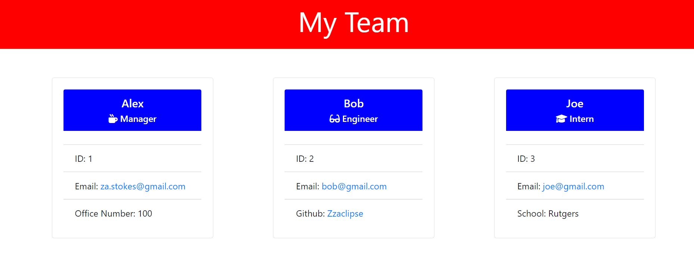

# theTerrificTeamProfileGenerator

## Table of Contents

- [Description](#description)
- [Installation](#installation)
- [Usage](#usage)
- [Tests](#tests)
- [Questions](#questions)
- [License](#license)

## Description

This application will take user input about the managers team. Once all information is added it will create an HTML page with all the entered information. The GitHub and email fileds are clickable and will take you to the GitHub of the engineer or the email of the selected team member.

## Installation

You can clone the repository from this command:

```bash
git clone https://github.com/Zzaclipse/theTerrificTeamProfileGenerator.git
```

## Usage

The application will be invoked in the command line by using the following command:

```bash
node index.js
```

Once the application is started it will ask for the managers information. Once entered it will give you a choice to add and intern or engineer or exit the program. Once the desired amount of team members have been added and you exit the program, a html file will be created including all entered information.

## Tests

To run tests use the following command:

```bash
npm test
```

the test files will run various tests including proper construction of the objects with strings and numbers correctly placed, and testing all methods in all classes.

## Questions

What is the developers github?

[Zzaclipse](https://github.com/Zzaclipse)

Where can I reach the developer to ask additional questions?

za.stokes@gmail.com

## License

This application is licened under ISC License

[](https://opensource.org/licenses/ISC)

## Link to video walkthrough

[Walkthough](https://drive.google.com/file/d/1tOMMYDc0vqvDOlNMKaDW1kw7uXGqQBeE/view)

## Screenshot of created HTML


